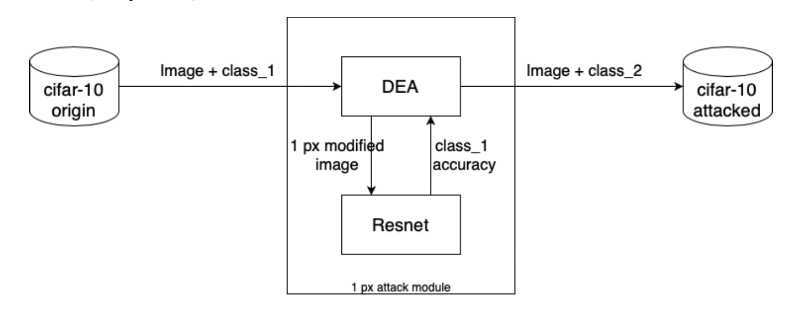
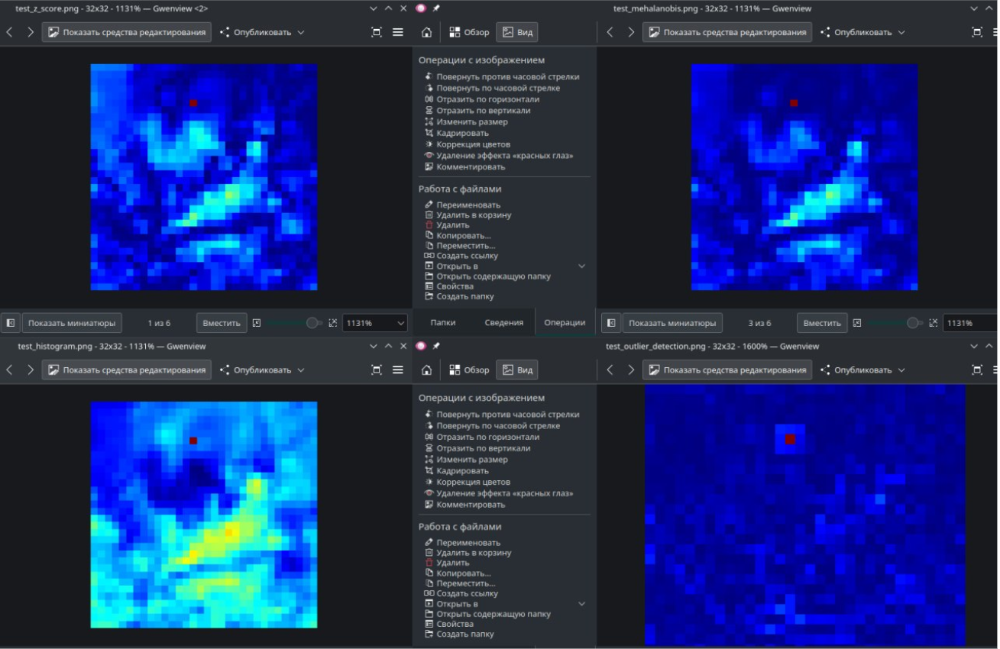
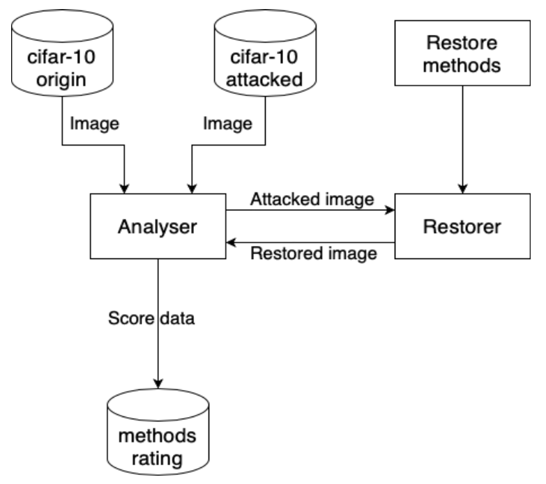

# Detect one Pixel attack and restore image

## Preparing
1. Select CNN: **resnet**
2. Select Dataset: **cifar10**
3. Create attacked dataset by one pixel attack

## Detect
For detecting we use statistic methods 

## Restore image
For restore image we use statistic methods.

To read more follow the link: [Info link](./fixers/README.md)

Restore scheme:

___

